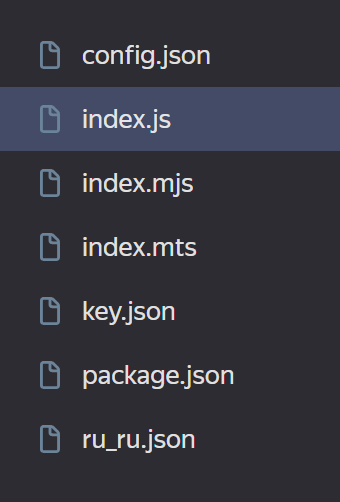

# KoBot
Простой Telegram бот для анонимных комплиментов

## Настройка сервисов Yandex Cloud

### Установка Yandex Cloud CLI

Для установки следуйте инструкции от Яндекса: https://cloud.yandex.ru/docs/cli/quickstart

### Создание базы данных

1. Создайте сервисный аккаунт и добавьте ему роль `ydb.admin`.
2. Создайте базу данных в разделе Managed Service for YDB. Тип: Serverless. Обязательно установите ограничение на объём данных в 1 ГБ, чтобы пользоваться только бесплатной квотой.

### Получение IAM ключа

В командной строке выполните команду: `yc iam key create --output key.json --service-account-id [paste service account id]`. Замените [paste service account id] на id сервисного аккаунта, который будет использоваться для доступа к бд. Поместите файл в папку с программой.

## Конфигурация бота

1. Переименуйте файл `config.json.RENAME` в `config.json`.
2. Заполните все поля файла конфигурации и сохраните.

____

## Локальное развёртывание

### Установка

1. Установите node.js
2. Склонируйте репозиторий и разархивируйте
3. В скачанной папке выполните команду `npm i`.
4. Создайте IAM ключ. См. инструкцию выше.

### Запуск

Для запуска выполните команду `npm start`.

____

## Размещение в Yandex Cloud

### Настройка необходимых сервисов

Создайте Cloud Function. В редакторе создайте все необходимые файлы с содержимым из репозитория (или загрузите всё через zip архив):

Обязательно сделайте функцию публичной в Обзоре:


4. Создайте API Gateway со следующей спецификацией:
```
openapi: 3.0.0
info:
  title: kobot
  version: 1.0.0
servers:
- url: [Autogenerated server URL]
paths:
  /fshtb-function:
    post:
      x-yc-apigateway-integration:
        type: cloud-functions
        function_id: [Cloud Function ID]
      operationId: fshtb-function

```
5. Подождите немного пока API Gateway инициализируется и протестируйте бота